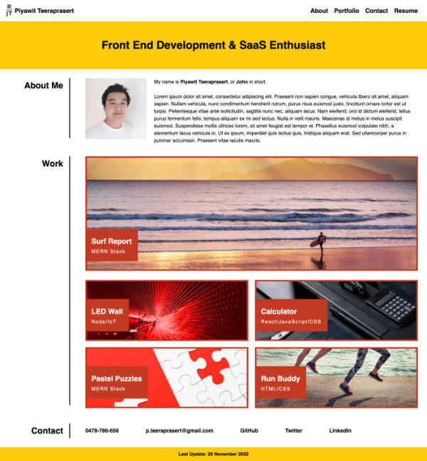
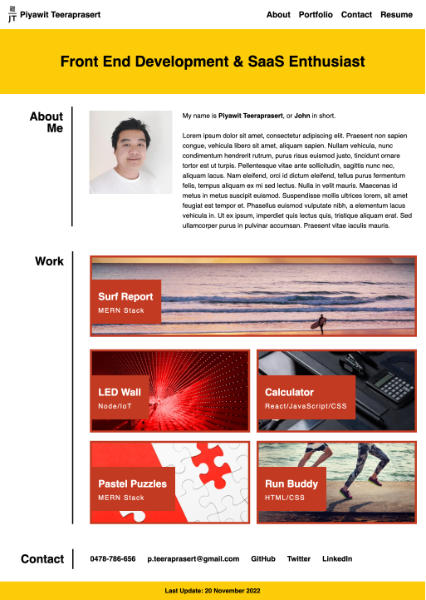

# W2-challenge-portfolio-piyawit-teeraprasert

In week 2 challenge, we're assigned to create an online portfolio page using PHP and CSS languages from scratch. The primary purpose of this challenge is to familiarize us with a multi-layer flexbox CSS layout as well as a corresponding HTML structure. Other CSS properties learnt in class that have been applied to this assignment include:
- Custom CSS Variable
- CSS pseudo class
- font-size
- paddings
- margins
- @media screen

*Note:* Please only use Chrome Inspect Elements to test screen responsiveness of my site. Resizing browser manually doesn't yield the same responsive display result.

## **URLs**
- [Deployed Application URL](https://jouriena11.github.io/W2-challenge-portfolio-piyawit-teeraprasert/)
- [GitHub Repository URL](https://github.com/jouriena11/W2-challenge-portfolio-piyawit-teeraprasert)

## **Concepts learnt:**

- By default, an HTML page has a [```display: block;```]

- To apply ```justify-content: space-between``` (e.g. space between logo and navigation menu), ```display: flex;``` must be applied to the parent element; ```justify-content: ;``` must also be applied to the parenet element

- By default, a flexbox is has ```flex-direction: row;``` so there's no need to specify this again in the CSS file. The exception would be when ```flex-direction: column;``` is applied at a certain point and ```flex-direction: row;``` must be applied again to change the flexbox direction back to row.

- When it comes to screen responsiveness testing, manual resizing of a browser window gives a different outcome from changing screen dimension in Chrome Inspect Elements. Using Chrome Inspect Elements to alone to test the screen responsiveness is advised.

- To create a text-box overlay, the text box must be within a container, and the following CSS properties must be applied:
    - ```position: relative;```
    - ```bottom: (value);``` 

- It is advised that pixel unit are best to specify paddings and margins.

Please suggest on my flexbox CSS settings.

## **Screenshots:**

* At size 1400px and below, the portfolio page should resemble the following image:



* At size 1024px and below, the portfolio page should resemble the following image:



* At size 768px and below, the portfolio page should resemble the following image:


* At size 576px and below, the portfolio page should resemble the following image:

